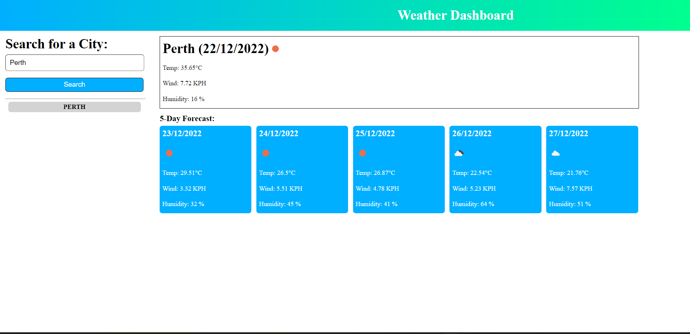

# Weather-Dashboard
Lookup the weather in a city of your choice

## Desciption

This web application used API calls to return the weather forecasts for today and the next 5 days 

## User Story

```
AS A traveler
I WANT to see the weather outlook for multiple cities
SO THAT I can plan a trip accordingly
```

## Acceptance Criteria

```
GIVEN a weather dashboard with form inputs
WHEN I search for a city
THEN I am presented with current and future conditions for that city and that city is added to the search history
WHEN I view current weather conditions for that city
THEN I am presented with the city name, the date, an icon representation of weather conditions, the temperature, the humidity, and the wind speed
WHEN I view future weather conditions for that city
THEN I am presented with a 5-day forecast that displays the date, an icon representation of weather conditions, the temperature, the wind speed, and the humidity
WHEN I click on a city in the search history
THEN I am again presented with current and future conditions for that city
```


## Installation


Live Link: https://harryward-15.github.io/Weather-Dashboard/

## Usage

This is my weather app, simply enter a city of your choice and click search! You will be shown the weather forecasts for the next 5 days. If you want to go back and look at a previous search, simply click the grey boxes on the left :)

## Credits

UWA Bootcamp Spot - User Story and Acceptance Criteria.

## License

Please see LICENSE file in repo

